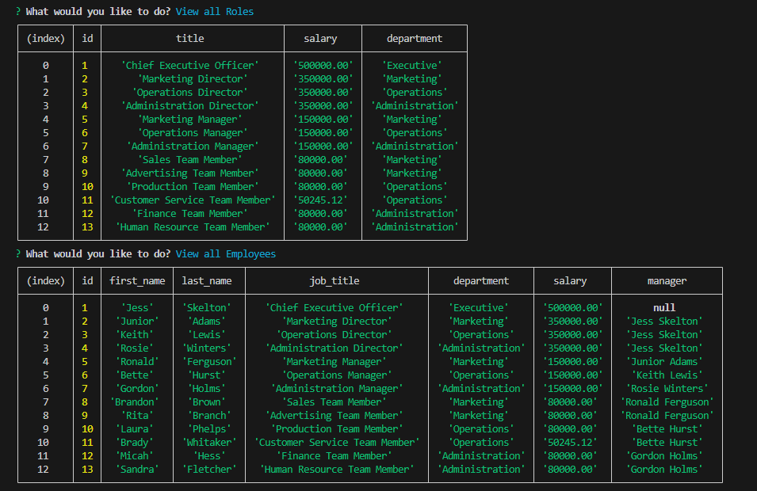

# employee-tracker

## Description
Challenge 12 -- MySQL: Employee Tracker

This project was built in order to create an interface that allows non-developers to easily view and interact with information stored inside the created employee database. This app will help view manage a companys employee database including departments, roles, and employees using Node.js, Inquirer, and MySQL in order for organization and planning of business to be easier.  

When the command line program is run to access the database, you will be given inquirer prompts to select the following options from the main menu: View all Departments, View all Roles, View all Employees, Add a Department, Add a Role, Add an Employee, Update an Employee & Exit. I have also included the 5 bonus functionalities being: View Employees by Manager, View Employees by Department, View total utilized budget, Update Manager of Employee, & Delete a Department, Role, or Employee.

## Table of Contents

- [Installation](#installation)
- [Usage](#usage)
- [Credits](#credits)
- [License](#license)
- [Badges](#badges)
- [Features](#features)
- [Questions](#questions)

## Installation

In order to run the program, please use `npm i` in order to install the required dependiencies listed in the package.json being "dotenv", "inquirer", & "mysql2".

Also be sure to log into MySQL inside the terminal, and enter both `source schema.sql` & `source seeds.sql` in order to ensure complete connection to the created database.

## Usage

Begin the program by typing into your terminal `node server.js` (Please make sure to have previously installed the programs dependencies mentioned in the [Installation](#installation) section) -- Then just select any desired option from the menu and follow any additional prompts if they come up.

Walkthrough video showing functionality of program:
* Link to walkthrough video: *(click the code snippet)*

## Credits

I recieved some help from my tutor, Bobbi Tarkany, debugging the functions for viewByManager & updateManager as well as adding .env functionality in order to protect passwords using good practice. Please check out her work by visiting her [GitHub](https://github.com/bltarkany).

## License

[MIT License](https://opensource.org/licenses/MIT)

## Badges

## Features

For application-specific features, please revisit the [Description](#description) & [Usage](#usage) sections

* JavaScript
* Node
* Inquirer
* MySQL
* .env

## Questions

If you have any questions, feel free to reach out to me via [GitHub](https://github.com/jskelly8/) or email me at jessskelton888@gmail.com.